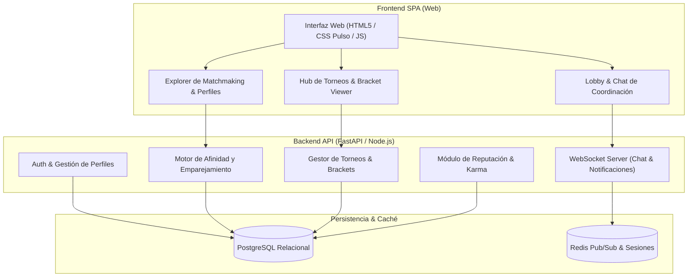

# PlayMatch

> Plataforma web de emparejamiento social y gestión de torneos amateur para la comunidad gamer chilena. Conecta jugadores por compatibilidad de rango y horarios, combate la toxicidad de la *solo queue* y centraliza la organización de torneos sin depender de planillas dispersas. Un producto de **VoxTi Labs** desarrollado en el marco del Proyecto de Portafolio de Título de Ingeniería en Informática (Duoc UC San Joaquín).

[](https://github.com/voxtilabs/PlayMatch)
[-3D5AFE?style=for-the-badge)](docs/BRANDING_DESIGN.md)
[](#)

---

## 1. El Problema & La Solución

### El Problema
1. **La Crisis de la Solo Queue:** En juegos como *Valorant*, *League of Legends*, *CS2* y *Rocket League*, los jugadores sin equipo fijo sufren frustración, horarios incompatibles y altos índices de toxicidad.
2. **Torneos Amateur Desorganizados:** Los torneos comunitarios y universitarios en Chile se coordinan de forma precaria a través de chats de Discord saturados y planillas de Google Sheets propensas a errores, sin actualización en vivo de resultados ni llaves (*brackets*).

### La Solución: PlayMatch
- **Matchmaking Social Inteligente:** Algoritmo que empareja jugadores evaluando cercanía de rango, horarios habituales (tardes, noches, fines de semana), preferencia de comunicación por micrófono y estilo de juego.
- **Sistema de Karma & Honor Anti-Toxicidad:** Puntuación de convivencia asignada mediante valoraciones positivas post-partida que aísla las conductas tóxicas.
- **Hub de Torneos con Brackets Automáticos:** Creación e inscripción de torneos comunitarios con generación automática de llaves de eliminación directa y reporte de resultados en vivo.
- **Salas de Coordinación Privadas:** Salas temporales con chat integrado y copiado rápido de Discord y Riot/Steam IDs.

---

## 2. Documentación Técnica del Proyecto

- **Especificación de Arquitectura & Datos:** [`docs/SPEC.md`](docs/SPEC.md)
- **Catálogo de Issues para GitHub:** [`docs/ISSUES.md`](docs/ISSUES.md)
- **Matriz de Funcionalidades & Roadmap:** [`docs/ROADMAP_FEATURES.md`](docs/ROADMAP_FEATURES.md)
- **Sistema de Diseño & Identidad Visual (Pulso):** [`docs/BRANDING_DESIGN.md`](docs/BRANDING_DESIGN.md)

---

## 3. Arquitectura del Sistema (Visión de Ingeniería)



---

## 4. Ejecución Rápida de la Versión Preliminar

La versión preliminar es totalmente autónoma, reactiva y se ejecuta sin necesidad de instalar dependencias externas pesadas:

### Opción 1: Servidor Local con Python
```bash
# Dentro de la carpeta del proyecto:
python -m http.server 3000
```
Luego abre tu navegador en `http://localhost:3000`.

### Opción 2: Apertura directa
Puedes hacer doble clic en el archivo [`index.html`](index.html) para interactuar directamente con la plataforma en cualquier navegador moderno.

---

## 5. Planificación Oficial (Carta Gantt 18 Semanas)

| Fase | Semanas | Estado | Entregable Técnico Principal |
| :--- | :---: | :---: | :--- |
| **Fase 1: Requerimientos & Modelo de Datos** | S1 a S4 | **Completado** | Levantamiento, arquitectura de software, modelo relacional y prototipado visual. |
| **Fase 2: Backend, Matchmaking & Torneos** | S5 a S14 | **En Curso (MVP)** | Desarrollo modular: autenticación, motor de afinidad, sockets de coordinación y brackets. |
| **Fase 3: Docker, QA & Despliegue** | S15 a S18 | **Planificado** | Contenerización Docker, pruebas funcionales, métricas y defensa de título. |

---

## 6. Equipo & Créditos

- **Desarrollador / Autor Principal:** Estudiante de Ingeniería en Informática, Duoc UC San Joaquín.
- **Ecosistema de Marca:** [VoxTi Labs](https://github.com/voxtilabs) — *Sistema de Diseño Pulso*.
- **Licencia:** MIT.
